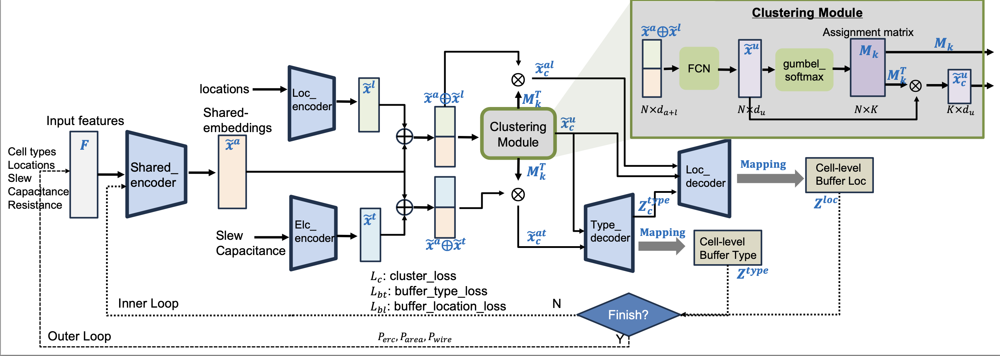

# MLBuf: Recursive Learning-Based Virtual Buffering for Analytical Global Placement

> An open-source learning-driven virtual 
buffering-aware analytical global placement framework, 
built on top of the OpenROAD infrastructure.




## Code Structure
```bash
MLBuf/   
├── data/                     # Data loading and preprocessing scripts
│   ├── buf_data.csv          # Buffer information
│   ├── data_loader.py        # Load dataset
│   └── training_data         # Training dataset
├── models/                   # Model architecture 
│   ├── model.py              # MLBuf model
│   ├── inference.py          # MLBuf model inference
│   ├── losses.py             # Loss functions
│   └── layers.py             # Custom layers or modules
├── utils/                    # Utility functions and helper scripts
│   ├── adhoc_baseline.py     # Ad-Hoc baseline for comparison
│   ├── util.py               # Utility functions such as feature update
│   └── plot_utils.py         # Visualize training curves
├── scripts/                  # Scripts for global placement and evaluation
│   ├── invs_scripts          # Commercial tool scripts for generating post-route results 
│   └── OR_scripts            # OpenROAD scripts for global placement
├── train.py                  # Entry point for training the model
├── OR_branch_integration/    # MLBuf-RePlAce
├── LICENSE                   # License
└── README.md                 # Project documentation
```

## Training MLBuf
To train MLBuf, run the following command:
```bash
pip install -r requirements.txt
python train.py
```

Results are written to results/:
```bash
results/
├── model_dict/     # trained model (.pt)
├── plot/           # Loss curves (.png)
└── btree_pred/     # Predicted buffer trees (.csv)
```

## Integrating MLBuf into OpenROAD for MLBuf-RePlAce
1. **Build OpenROAD** using the version provided in:
```bash
OR_branch_integration/OpenROAD
```
2. Run **MLBuf-RePlAce**
```bash
scripts/OR_scripts/${DESIGN_NAME}/run_mlbuf.sh
```
3. (Optional) Run baseline comparisions:

- **AD-Hoc Baseline**
```bash
scripts/OR_scripts/${DESIGN_NAME}/run_baseline_adhoc.sh
```
- **RePlAce** (no timing-driven mode [commit hash: df581be])
```bash
scripts/OR_scripts/${DESIGN_NAME}/run_baseline_no_timing.sh
```
- **TD-RePlAce** (default virtual buffering-based timing driven global placement in OpenROAD [commit hash: df581be])
```bash
scripts/OR_scripts/${DESIGN_NAME}/run_baseline_rsz_virtual.sh
```
