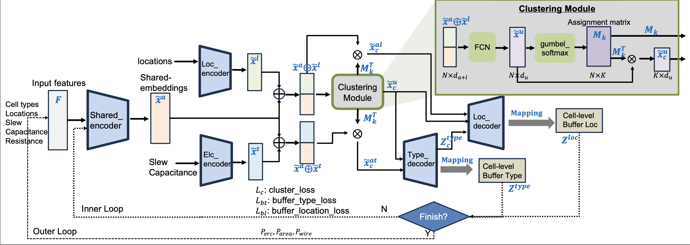

# MLBuf: Recursive Learning-Based Virtual Buffering for Analytical Global Placement 

An open-source learning-driven virtual 
buffering-aware analytical global placement framework, 
built on top of the OpenROAD infrastructure.

[Paper link](https://vlsicad.ucsd.edu/Publications/Conferences/416/c416.pdf) (Best Artifact Award, MLCAD25)




## Code Structure
```bash
MLBuf/   
├── data/                     # Data loading and preprocessing scripts
│   ├── buf_data.csv          # Buffer information
│   ├── data_loader.py        # Load dataset
│   └── training_data         # Training dataset
├── models/                   # Model architecture 
│   ├── model.py              # MLBuf model
│   ├── inference.py          # MLBuf model inference
│   ├── losses.py             # Loss functions
│   └── layers.py             # Custom layers or modules
├── results/                   # Model results 
├── utils/                    # Utility functions and helper scripts
│   ├── adhoc_baseline.py     # Ad-Hoc baseline for comparison
│   ├── util.py               # Utility functions such as feature update
│   └── plot_utils.py         # Visualize training curves
├── scripts/                  # Scripts for global placement and evaluation
│   ├── invs_scripts          # Commercial tool scripts for generating post-route results 
│   └── OR_scripts            # OpenROAD scripts for global placement
├── train.py                  # Entry point for training the model
├── requirements.txt          # Dependencies for model training
├── env_or.sh                 # Environments for OpenROAD and ORFS 
├── OR_branch_integration/    # MLBuf-RePlAce
├── OR_inputs/                # Designs & platform
├── LICENSE                   # License
└── README.md                 # Project documentation
```

## Training MLBuf
To train MLBuf, run the following command:
```bash
pip install -r requirements.txt
python train.py
```

Results are written to results/:
```bash
results/
├── model_dict/     # trained model (.pt)
├── plot/           # Loss curves (.png)
└── btree_pred/     # Predicted buffer trees (.csv)
```
You can directly use our pre-trained model:
```bash
results/model_dict/mlbuf-pretrained.pt
```
## Integrating MLBuf into OpenROAD for MLBuf-RePlAce
1. **Build OpenROAD** in the OR_branch_integration directory using the version [OpenROAD (mlbuf-public-release branch)](https://github.com/ytliu8464/OpenROAD/tree/mlbuf-public-release) 
```bash
cd OR_branch_integration
git clone --recursive -b mlbuf-public-release git@github.com:ytliu8464/OpenROAD.git
cd OpenROAD
mkdir build && cd build
cmake ..
make -j "$(nproc)"
```
2. Run **MLBuf-RePlAce**
```bash
scripts/OR_scripts/${DESIGN_NAME}/run_mlbuf.sh
```
Please run this script inside a Python-enabled environment.

3. (Optional) Run baseline comparisions:

- **AD-Hoc Baseline**
```bash
scripts/OR_scripts/${DESIGN_NAME}/run_baseline_adhoc.sh
```
- **RePlAce** (no timing-driven mode [commit hash: df581be])
```bash
scripts/OR_scripts/${DESIGN_NAME}/run_baseline_no_timing.sh
```
- **TD-RePlAce** (default virtual buffering-based timing driven global placement in OpenROAD [commit hash: df581be])
```bash
scripts/OR_scripts/${DESIGN_NAME}/run_baseline_rsz_virtual.sh
```

We also release .odb global placement results generated by MLBuf-RePlAce, AD-Hoc baseline, RePlAce and TD-RePlAce in the following directory:
```bash
scripts/OR_scripts/{design}/{method}.odb
```

## Evaluation

To reproduce the post-route results reported in Table IV, use the global placement results generated by **MLBuf-RePlAce** as the starting point for downstream flows in **OpenROAD-flow-scripts (ORFS)**.

**Steps:**

1. Set up and build **OpenROAD-flow-scripts (ORFS)** using the version [ORFS (mlbuf-orfs-public branch)](https://github.com/ytliu8464/OpenROAD-flow-scripts/tree/mlbuf-orfs-public) 

2. Run automation scripts to generate post-route results:
```bash
source OpenROAD-flow-scripts/flow/mlbuf_run_scripts/run_{method}.sh
```
Update these environment variables before running:
- **PROJ_DIR**: path to this MLBuf_MLCAD repository  
- **FLOW_HOME**: path to OpenROAD-flow-scripts 

3. After the run completes, all metrics (timing, power) will be available in:
```bash
mlbuf_run_scripts/logs/{platform}/{design}/(method)/*.log
```
These logs contain the detailed post-route evaluation results used in the paper.

**Note**: To fully reproduce results, ensure the execution environment for OpenROAD and ORFS matches ours. The environment setup is provided in env_or.sh.


## Reference
Please cite our work if you find our code useful.
```bash
A. B. Kahng, Y. Liu and Z. Wang, 
"Recursive Learning-Based Virtual Buffering for Analytical Global Placement", 
Proc. ACM/IEEE Intl. Symp. on Machine Learning for CAD (MLCAD), 2025.
```